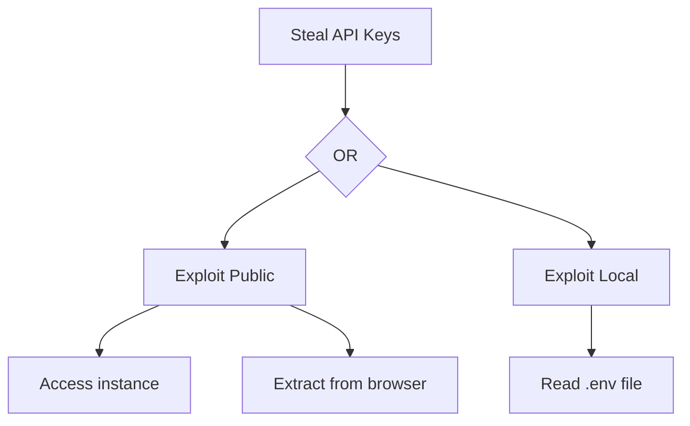

# Attack Trees

An attack tree is a hierarchical representation of how a threat could be
realised. Build one when the user asks to visualise attack paths, or when a
high-value threat warrants decomposition.

## Structure

- **Root goal** — the primary objective the attacker wants to achieve.
- **Sub-goals** — intermediate objectives that support the root goal.
- **Attack methods** — specific techniques or vulnerabilities that enable each
  sub-goal.
- **Prerequisites** — conditions or access required for each attack method.

Use **AND** / **OR** nodes: OR means any child suffices; AND means all children
are required. Start from the high-level goal and decompose into concrete attack
vectors and their prerequisites.

## Common patterns

- **Reconnaissance** — information gathering, system enumeration, social engineering.
- **Initial access** — phishing, credential stuffing, vulnerability exploitation.
- **Privilege escalation** — local exploits, credential theft, authorization bypass.
- **Persistence** — backdoors, scheduled tasks, registry modification.
- **Exfiltration** — data staging, command and control, covert channels.

## Output formats

**Text** — ASCII tree using `└──` and `├──`:

```
Goal: Steal API Keys
├── [OR] Exploit Public Deployment
│   ├── Access public instance
│   └── Extract from browser
└── [OR] Exploit Local Deployment
    └── Read .env file
```

**Mermaid** — graph syntax for rendered diagrams:



**JSON** — structured representation:

```json
{
  "root": "Steal API Keys",
  "type": "OR",
  "children": [
    { "goal": "Exploit Public Deployment", "methods": ["Access instance", "Extract from browser"] }
  ]
}
```

Default to providing both the text and Mermaid forms unless the user asks for a
specific format.
